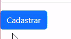
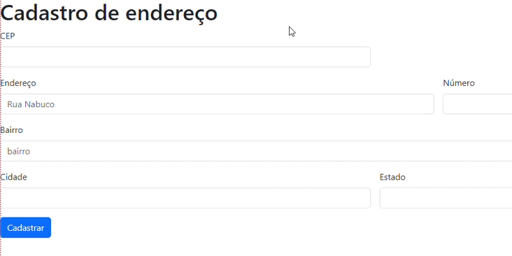
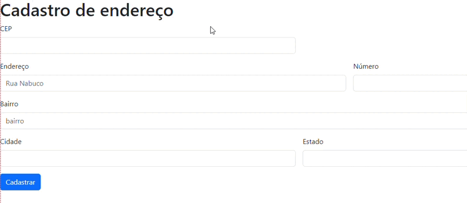
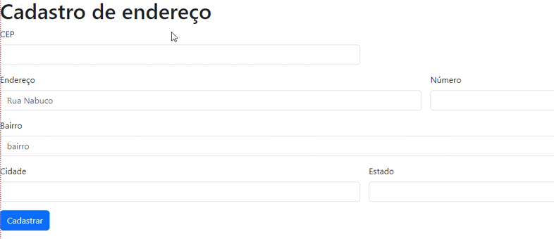

# Descriçao

**Tela de cadastro de endereço onde o usuário irá inserir seu CEP, e a página irá preencher os campos automaticamente, e logo após ele (o usuário) irá apertar o botão "Cadastrar" para concluir o cadastro.**

# Introdução

**_O usuário irá preencher o espaço do "CEP"._**

**_Depois de inserir o CEP, os espaços serão preenchidos automaticamente._**

**_E após preencher automáticamente todos os campos, o usuário irá selecionar, com o mouse, o botão "Cadastrar"._**

**_Caso o CEP estiver incorreto, a página irá notificar o usuário através de um pop-up._**

## Funcionalidades

`FUNCIONALIDADE 1` - _Preenchimento automático quando o usuário inserir o CEP._

`FUNCIONALIDADE 2` - _Pop-up de aviso ao usuário se o CEP estiver errado._

`FUNCIONALIDADE 3` - _Pop-up de aviso ao usuário se o CEP não for encontrado._

## Tecnologias Utilizadas

Foi usado para esse código:

* HTML5 (Para o corpo da Página) 
* JavaScript (Para as funções da Página)
> * Foi usado a expressão regular **/^[0-9]+$/.test(numero)**, Que é usada para encontrar qualquer caractere que NÃO seja um dígito. Os dígitos entre colchetes podem ser quaisquer números ou intervalos de números de 0 a 9. Ela testa o número informado.
> * Já o **document.getElementById('cep').addEventListener('focusout', pesquisarCep)** adiciona evento DOM ao input do CEP para executar função _pesquisarCep_.
> * Também foi usado o **hasOwnPeoperty**, e caso queira saber sobre, visite o site: https://developer.mozilla.org/pt-BR/docs/Web/JavaScript/Reference/Global_Objects/Object/hasOwnPropertyhasOwnProperty.
> * E além desses, foi usado a expressão **await**, que faz a execução de uma função **async** pausar, para esperar pelo retorno da Promise, e resume a execução da função async quando o valor da Promise é resolvido. Ele então retorna o valor final da Promise. Se esse valor não for uma Promise, ele é convertido para uma Promise resolvida. Se a Promise for rejeitada, a expressão await invoca uma Exception com o valor rejeitado.
> * Uma **Promise** é um proxy para um valor não necessariamente conhecido quando a promise é criada. Ele permite que você associe manipuladores ao valor de sucesso ou motivo de falha de uma ação assíncrona. Isso permite que métodos assíncronos retornem valores como métodos síncronos: em vez de retornar imediatamente o valor final, o método assíncrono retorna uma promise para fornecer o valor em algum momento no futuro. O objeto Promise representa a eventual conclusão (ou falha) de uma operação assíncrona e seu valor resultante.
> * A API **Fetch** fornece uma interface JavaScript para acessar e manipular partes do pipeline HTTP, tais como os pedidos e respostas.
> * **JSON** é uma sintaxe para serialização de objetos, matrizes, números, strings, booleanos, e null. Baseia-se em sintaxe Javascript, mas é distinta desta: alguns Javascript não são JSON, e alguns JSON não são Javascript.
* [ViaCep](https://viacep.com.br/) (Para os códigos do JavaScript)
* [Bootstrap](https://getbootstrap.com/) (Para o botão "Cadastrar")
* Também teve a ajuda do professor [Leonardo Rocha](https://github.com/leonardossrocha)

### Autor
---

<a href="https://github.com/SamuelCmdeFarias">
 
  
 <b>Samuel Camargo</b></a> <a href="https://github.com/SamuelCmdeFarias" title="Rocketseat">🚀</a>

Feito por Samuel Camargo ❤️👋🏽. Entre em contato!

